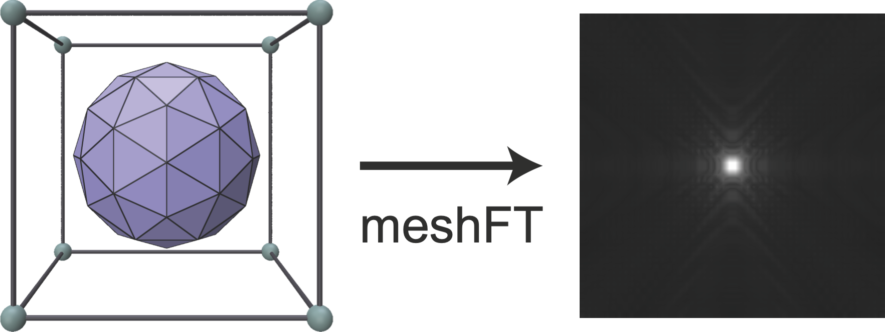

# meshFT
**meshFT** is a minimalistic PyTorch-based python library that provides a differentiable fourier transform that compute Fourier transform of triangle meshes in a given box. We support operations both on CPU and GPU. We provide **C++/CUDA** bindings to compute efficiently the forward and backward passes, to enable differentiable rasterization of triangulated data at scale. 



### Installation

`pip install meshft`


### Example 

Load a mesh and compute its Fourier transform

```shell
pip install meshFT

```

```py
import trimesh, torch, numpy
from meshft import compute_box_size, Fourier3dMesh

device = 'cpu'

#Create a sphere and convert Verts, Faces into torch tensors
Mesh = trimesh.primitives.Sphere(subdivisions = 1)
faces = numpy.array(Mesh.faces)
verts = numpy.array(Mesh.vertices)
Verts = torch.tensor(verts,dtype = torch.float,requires_grad=True)
Faces = torch.tensor(faces,dtype = torch.long)

#Give the dimensions of the box
box_size = np.array([[-1.2,  1.2],
                     [-1.2,  1.2],
                     [-1.2,  1.2]])
#Or compute it automatically with a given offset
#box_size = compute_box_size(verts,offset=0.2)

#Give the dimensions of the voxel grid
box_shape = np.array([50]*3)

#Compute the mesh Fourier transform
meshFT = Fourier3dMesh(box_size,box_shape,device=device, dtype = torch.float32)
ftmesh = meshFT(Verts,Faces)

#Compute the backward pass
loss = torch.sum(torch.abs(ftmesh))
loss.backward()

#Visualize the inverse FT: 
#import napari
#a = torch.fft.ifftn(ftmesh)
#v = napari.view_image(np.abs(a.detach()).numpy())
```

---


### Credits, contact, citations
If you use this tool, please cite 


# meshFT
