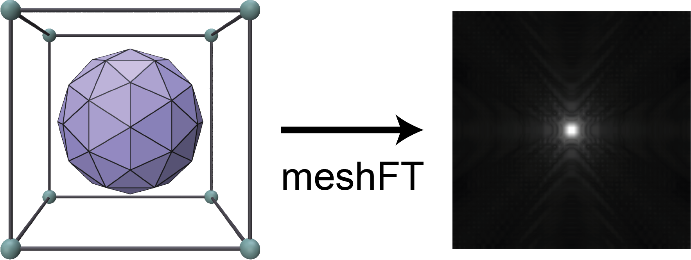

# meshFT
**meshFT** is a minimalistic PyTorch-based python library that provides a differentiable fourier transform that compute Fourier transform of triangle meshes in a given box. We support operations both on CPU and GPU. We provide **C++/CUDA** bindings to compute efficiently the forward and backward passes, to enable differentiable rasterization of triangulated data at scale. 



Our main contribution, that allows meshFT to compute transforms in tractable times, relies on a tunable narrow-band filter in the frequency space that avoid computing high frequencies of the Fourier transform. (see API)


### Installation
#### CPU installation
```shell
pip install meshFT
```
#### GPU installation
To use the meshFT with CUDA:
```shell
git clone https://github.com/sacha-ichbiah/meshFT.git && cd meshFT && pip install -e .
```


### Example 

Load a mesh and compute its Fourier transform


```py
import trimesh, torch
import numpy as np
from meshft import compute_box_size, Fourier3dMesh

device = 'cpu'

#Create a sphere and convert Verts, Faces into torch tensors
Mesh = trimesh.primitives.Sphere(subdivisions = 1)
faces = np.array(Mesh.faces)
verts = np.array(Mesh.vertices)
Verts = torch.tensor(verts,dtype = torch.float,requires_grad=True)
Faces = torch.tensor(faces,dtype = torch.long)

#Give the dimensions of the box
box_size = np.array([[-1.2,  1.2],
                     [-1.2,  1.2],
                     [-1.2,  1.2]])
#Or compute it automatically with a given offset
#box_size = compute_box_size(verts,offset=0.2)

#Give the dimensions of the voxel grid
box_shape = np.array([50]*3)

#Compute the mesh Fourier transform
meshFT = Fourier3dMesh(box_size,box_shape,device=device, dtype = torch.float32)
ftmesh = meshFT(Verts,Faces)

#Compute the backward pass
loss = torch.sum(torch.abs(ftmesh))
loss.backward()

#Visualize the inverse FT: 
#import napari
#a = torch.fft.ifftn(ftmesh)
#v = napari.view_image(np.abs(a.detach()).numpy())
```

---

### API and Documentation


- `Fourier3dMesh(self, box_size,box_shape,device = 'cpu', dtype = torch.float, gaussian_filter = False, sigma_base = 100.0, narrowband_thresh = 0.01)`: 
    - `box_shape: [x_res,y_res,z_res]` Size of the fourier box (in voxels)
    - `box_size:[[x_min,xmax],[y_min,y_max],[z_min,z_max]]` Dimensions of the box (in the spatial dimensions of the mesh)
    - `gaussian_filter` has to be set to `True` to activate the narrow-band filter
    - `sigma_base` defines the inverse width of the gaussian filter. Lower it to conserve more frequencies
    - `narrowband_thresh` threshold under which frequencies are not computed
---

### Credits, contact, citations
If you use this tool, please cite 


